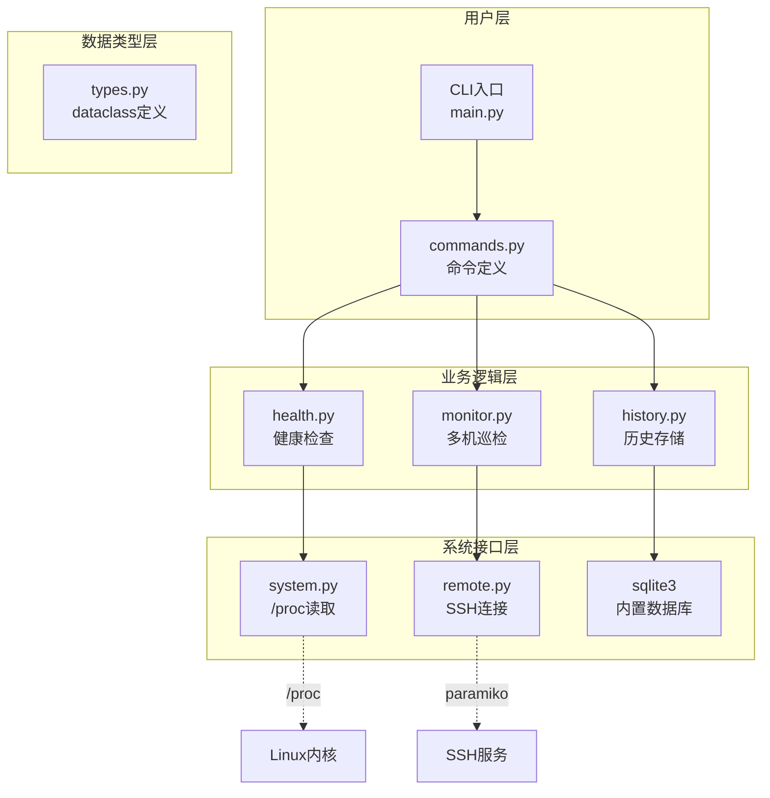
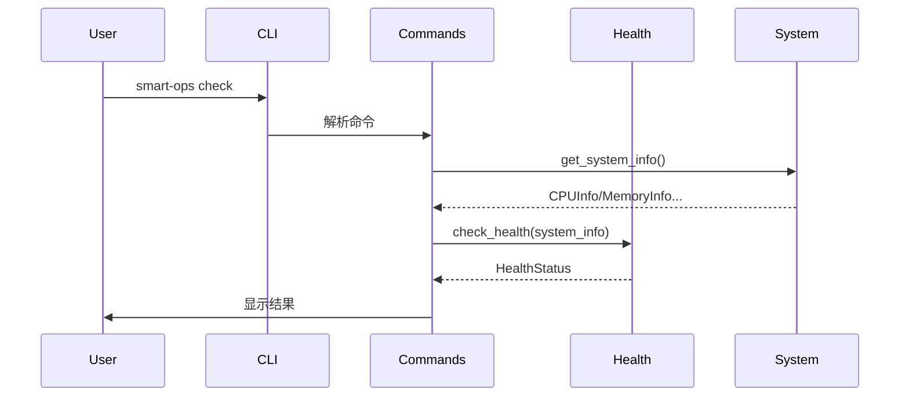

# Smart Ops CLI 架构文档

## 📚 文档目标

本文档帮助具有Python基础的开发者理解本工具的架构设计、代码组织、设计决策和系统知识。

**阅读前置知识：**
- 基本的Python语法（变量、函数、循环）
- 了解什么是CLI（命令行界面）

---

## 1. 项目整体架构

### 1.1 架构全景图

```
┌─────────────────────────────────────────────────────────────────────────────┐
│                              Smart Ops CLI                                  │
├─────────────────────────────────────────────────────────────────────────────┤
│                                                                              │
│  ┌─────────────────────────────────────────────────────────────────────┐    │
│  │                         用户层（CLI入口）                            │    │
│  │                                                                       │    │
│  │      $ smart-ops check --explain                                    │    │
│  │                ↓                                                    │    │
│  │         ┌──────────────┐                                            │    │
│  │         │   main.py    │  ← 程序入口，Click框架初始化                 │    │
│  │         │   commands   │  ← 命令定义（check/monitor/history）         │    │
│  │         └──────┬───────┘                                            │    │
│  └────────────────┼────────────────────────────────────────────────────┘    │
│                   ↓                                                         │
│  ┌─────────────────────────────────────────────────────────────────────┐    │
│  │                         业务逻辑层                                    │    │
│  │                                                                       │    │
│  │   ┌─────────┐    ┌─────────┐    ┌─────────┐    ┌─────────┐         │    │
│  │   │ health  │    │ system  │    │ monitor │    │ history │         │    │
│  │   │  健康检查 │    │ 系统信息 │    │  多机巡检 │    │ 历史存储 │         │    │
│  │   └────┬────┘    └────┬────┘    └────┬────┘    └────┬────┘         │    │
│  └────────┼──────────────┼──────────────┼──────────────┼───────────────┘    │
│           ↓              ↓              ↓              ↓                     │
│  ┌─────────────────────────────────────────────────────────────────────┐    │
│  │                         数据类型层                                    │    │
│  │                                                                       │    │
│  │   @dataclass HealthStatus    @dataclass HostReport    @dataclass CPUInfo │
│  │                                                                       │    │
│  └─────────────────────────────────────────────────────────────────────┘    │
│                                                                              │
│  ┌─────────────────────────────────────────────────────────────────────┐    │
│  │                         系统接口层                                    │    │
│  │                                                                       │    │
│  │   /proc/stat, /proc/meminfo     ← Linux内核信息                       │    │
│  │   psutil                          ← 跨平台系统信息库                   │    │
│  │   sqlite3                         ← 内置SQLite支持                    │    │
│  │   paramiko                        ← SSH远程连接                        │    │
│  └─────────────────────────────────────────────────────────────────────┘    │
│                                                                              │
└─────────────────────────────────────────────────────────────────────────────┘
```

### 1.2 分层架构说明

```
┌────────────────────────────────────────────────────────────────────────────┐
│                           为什么这样分层？                                    │
├────────────────────────────────────────────────────────────────────────────┤
│                                                                             │
│  用户层（CLI）    → 只负责「接收命令」和「格式化输出」                          │
│                          ↓                                                  │
│  业务逻辑层       → 只负责「处理数据」和「业务规则」                            │
│                          ↓                                                  │
│  数据类型层       → 只负责「定义数据结构」                                     │
│                          ↓                                                  │
│  系统接口层       → 只负责「读取系统信息」                                    │
│                                                                             │
│  好处：每层只做一件事，修改其中一层不影响其他层                                │
│  例如：修改输出格式（JSON→表格）只需要改用户层                                  │
│                                                                             │
└────────────────────────────────────────────────────────────────────────────┘
```

---

## 2. 命令执行流程

### 2.1 check 命令执行流程

```
$ smart-ops check --explain
                    │
                    ▼
┌─────────────────────────────────────────────────────────────────────────────┐
│ Step 1: main.py 入口                                                         │
│ ─────────────────────────────────────────────────────────────────────────── │
│                                                                             │
│   @click.command(name="check")          # 定义命令                           │
│   def check_cmd():                       # 命令处理函数                       │
│       system_info = get_system_info()    # 采集系统信息                       │
│       health_result = check_health(system_info)  # 健康检查                  │
│       display(health_result)             # 显示结果                          │
│                                                                             │
└─────────────────────────────────────────────────────────────────────────────┘
                    │
                    ↓
┌─────────────────────────────────────────────────────────────────────────────┐
│ Step 2: system.py - 采集系统信息                                             │
│ ─────────────────────────────────────────────────────────────────────────── │
│                                                                             │
│   ┌─────────┐    ┌─────────┐    ┌─────────┐    ┌─────────┐                │
│   │ get_cpu │    │ get_mem │    │ get_disk│    │get_netwk│                │
│   └────┬────┘    └────┬────┘    └────┬────┘    └────┬────┘                │
│        ↓              ↓              ↓              ↓                        │
│   /proc/stat    /proc/meminfo  /proc/diskstats  /proc/net/dev              │
│                                                                             │
└─────────────────────────────────────────────────────────────────────────────┘
                    │
                    ↓
┌─────────────────────────────────────────────────────────────────────────────┐
│ Step 3: health.py - 健康检查                                                │
│ ─────────────────────────────────────────────────────────────────────────── │
│                                                                             │
│   check_health(system_info):                                                │
│       for 指标 in [CPU, 内存, 磁盘, 网络]:                                  │
│           value = system_info[指标]                                         │
│           status = check_threshold(value, 阈值)  # 判断是否告警              │
│           if status != 正常:                                                 │
│               advice = DIAGNOSTIC_ADVICE[指标][问题类型]                      │
│       return {"status": "正常", "CPU": {...}, ...}                          │
│                                                                             │
└─────────────────────────────────────────────────────────────────────────────┘
                    │
                    ↓
┌─────────────────────────────────────────────────────────────────────────────┐
│ Step 4: commands.py - 输出结果                                              │
│ ─────────────────────────────────────────────────────────────────────────── │
│                                                                             │
│   if explain:                                                               │
│       print_explanation(health_result)  # 详细解释                         │
│   else:                                                                     │
│       print_summary(health_result)       # 简洁输出                         │
│                                                                             │
└─────────────────────────────────────────────────────────────────────────────┘
```

### 2.2 monitor 命令执行流程（多机巡检）

```
$ smart-ops monitor -H "root@192.168.1.100" --interval 300
                    │
                    ▼
┌─────────────────────────────────────────────────────────────────────────────┐
│ Step 1: 解析主机列表                                                         │
│ ─────────────────────────────────────────────────────────────────────────── │
│                                                                             │
│   hosts = ["root@192.168.1.100"]                                            │
│                                                                             │
└─────────────────────────────────────────────────────────────────────────────┘
                    │
                    ↓
┌─────────────────────────────────────────────────────────────────────────────┐
│ Step 2: 并发执行远程检查                                                     │
│ ─────────────────────────────────────────────────────────────────────────── │
│                                                                             │
│   with ThreadPoolExecutor(max_workers=4) as executor:                       │
│       for host in hosts:                                                    │
│           future = executor.submit(check_remote_host, host)                 │
│                                                                             │
│   ┌──────────┐  ┌──────────┐  ┌──────────┐  ┌──────────┐                   │
│   │ Host 1   │  │ Host 2   │  │ Host 3   │  │ Host 4   │                   │
│   │ SSH连接   │  │ SSH连接   │  │ SSH连接   │  │ SSH连接   │                   │
│   │ 执行命令  │  │ 执行命令  │  │ 执行命令  │  │ 执行命令  │                   │
│   └────┬─────┘  └────┬─────┘  └────┬─────┘  └────┬─────┘                   │
└────────┼─────────────┼─────────────┼─────────────┼─────────────────────────┘
         ↓             ↓             ↓             ↓
┌─────────────────────────────────────────────────────────────────────────────┐
│ Step 3: 汇总结果                                                             │
│ ─────────────────────────────────────────────────────────────────────────── │
│                                                                             │
│   for future in as_completed(futures):                                     │
│       result = future.result()                                              │
│       print(f"{host}: {result.status}")                                    │
│                                                                             │
└─────────────────────────────────────────────────────────────────────────────┘
```

---

## 3. 模块依赖关系图

```
                    ┌─────────────┐
                    │  main.py    │
                    │   (入口)    │
                    └──────┬──────┘
                           ↓
                    ┌─────────────┐
                    │ commands.py │ ← 依赖所有核心模块
                    └──────┬──────┘
                           │
       ┌───────────────────┼───────────────────┐
       ↓                   ↓                   ↓
┌─────────────┐    ┌─────────────┐    ┌─────────────┐
│  health.py  │    │ monitor.py  │    │ history.py  │
│  (核心检查)  │    │  (多机巡检)  │    │  (历史存储)  │
└──────┬──────┘    └──────┬──────┘    └──────┬──────┘
       │                   │                   │
       ↓                   ↓                   ↓
┌─────────────┐    ┌─────────────┐    ┌─────────────┐
│  system.py  │    │  remote.py  │    │  sqlite3    │
│  (系统信息)  │    │  (SSH连接)  │    │  (内置)     │
└──────┬──────┘    └──────┬──────┘    └─────────────┘
       │                   │
       ↓                   ↓
┌─────────────┐    ┌─────────────┐
│ /proc/*    │    │  paramiko   │
│ (Linux)    │    │  (SSH库)    │
└─────────────┘    └─────────────┘
```

---

## 4. 设计决策详解

### 4.1 为什么用 dataclass 而不是普通类？

**问题**：为什么要用 `@dataclass`？普通类不行吗？

**对比：**

```python
# 方式1：普通类（需要写很多样板代码）
class CPUInfo:
    def __init__(self, usage: float, cores: int, iowait: float):
        self.usage = usage
        self.cores = cores
        self.iowait = iowait

    def __repr__(self):
        return f"CPUInfo(usage={self.usage}, cores={self.cores})"

# 方式2：dataclass（自动生成样板代码）
from dataclasses import dataclass

@dataclass
class CPUInfo:
    usage: float
    cores: int
    iowait: float
    # 自动生成：__init__, __repr__, __eq__

# 使用
info = CPUInfo(usage=50.0, cores=4, iowait=5.0)
print(info)  # CPUInfo(usage=50.0, cores=4, iowait=5.0)
```

**结论**：dataclass 让代码更简洁，专注数据本身而不是样板代码。

### 4.2 为什么用 SQLite 而不是 MySQL/PostgreSQL？

**问题**：为什么用 SQLite？专业项目不都应该用 MySQL 吗？

**对比：**

| 特性 | SQLite | MySQL/PostgreSQL |
|------|--------|------------------|
| 安装 | 无需安装（Python内置） | 需要单独安装数据库服务 |
| 部署 | 直接运行 | 需要启动数据库服务 |
| 依赖 | 无 | 需要数据库驱动（pymysql等） |
| 适用场景 | 单机工具、嵌入式 | 多用户、高并发 |
| 数据量 | 支持TB级 | 支持TB级 |

**本工具的选择理由：**
1. **运维工具**通常是单机的，不需要多用户访问
2. **零依赖**原则：用户只需要Python，不需要装数据库
3. **简单运维**：文件即数据库，备份只需复制文件
4. **够用**：历史数据查询性能对单机工具足够

**什么时候用MySQL更合适？**
- 多台服务器需要共享数据
- 需要同时100+连接
- 需要复杂的SQL查询和事务

### 4.3 为什么用 Click 而不是 argparse？

**问题**：Python有argparse标准库，为什么用Click？

**对比：**

```python
# argparse（标准库，但繁琐）
import argparse
parser = argparse.ArgumentParser()
parser.add_argument("--host", "-H")
parser.add_argument("--port", "-p", type=int)
args = parser.parse_args()

# Click（更简洁、更强大）
import click
@click.command()
@click.option("-H", "--host")
@click.option("-p", "--port", type=int)
def cmd(host, port):
    pass
```

**Click的优势：**

| 特性 | argparse | Click |
|------|----------|-------|
| 装饰器语法 | 无 | ✅ 支持 |
| 自动生成帮助 | ✅ | ✅ 更美观 |
| 命令组（多命令） | 复杂 | ✅ 简单 |
| 颜色输出 | 无 | ✅ 支持 |
| 进度条 | 无 | ✅ 支持 |

**本工具的选择理由：**
- 需要多个命令（check/monitor/history等），Click命令组更清晰
- 帮助文档需要美观（运维友好）
- 简单场景用`@click.option`非常方便

### 4.4 为什么用SSH远程执行而不是Agent？

**问题**：远程巡检可以用Agent（需要在远程部署服务），为什么选SSH？

**对比：**

| 方式 | SSH远程执行 | Agent部署 |
|------|------------|-----------|
| 部署复杂度 | 低（无需部署） | 高（需要部署Agent） |
| 维护成本 | 低（SSH标准） | 高（需要升级维护Agent） |
| 适用场景 | 临时巡检 | 长期监控 |
| 权限需求 | SSH账号 | Agent系统权限 |
| 数据实时性 | 巡检时获取 | 持续获取 |

**本工具的选择理由：**
1. **运维工具的定位**：不是企业级监控平台，不需要长期Agent
2. **零部署原则**：用户只需要SSH账号，不需要在被监控机器安装任何东西
3. **灵活性**：随时可以巡检任意机器，不需要提前配置
4. **安全性**：SSH是标准协议，有完善的安全机制

**什么时候用Agent更合适？**
- 需要实时监控（持续采集，不是定时巡检）
- 机器数量很多（几百台）
- 需要更丰富的指标（Agent可以采集更多数据）

### 4.5 为什么用 ThreadPoolExecutor 而不是多进程？

**问题**：为什么用线程池而不是多进程？

```python
# 线程池（IO密集型，SSH连接等待）
with ThreadPoolExecutor(max_workers=4) as executor:
    futures = [executor.submit(ssh_call, host) for host in hosts]

# 多进程（CPU密集型）
from multiprocessing import Pool
with Pool(4) as p:
    results = p.map(cpu_task, items)
```

**选择依据：**

| 场景 | 推荐 | 原因 |
|------|------|------|
| SSH远程调用（等待网络） | 线程池 | IO等待时线程阻塞，线程切换开销小 |
| CPU密集计算 | 多进程 | 绕过GIL利用多核 |
| 简单并行 | ThreadPoolExecutor | 语法简单，够用 |

**本工具的选择理由：**
- 远程巡检主要是**IO等待**（SSH连接、命令执行）
- 线程切换开销小，资源占用低
- 简单场景不需要多进程复杂度

### 4.6 GIL 与 IO 的关系（补充知识）

**常见疑问**：Python 不是有 GIL（全局解释器锁）限制吗？为什么还能用线程？

**答案**：GIL 只影响**CPU计算**，不影响**IO等待**。

```
GIL的工作原理：
┌─────────────────────────────────────────────────────────────┐
│                                                             │
│  Python代码执行时：                                          │
│                                                             │
│  CPU计算任务：  ──→ GIL锁定 ──→ 只能一个线程执行             │
│                     ↑                                       │
│                     │ 同一时刻只有一个线程能执行Python代码    │
│                                                             │
│  IO等待时：      ──→ 自动释放GIL ──→ 其他线程可以执行        │
│                     ↓                                       │
│                     │ IO操作时Python会释放锁，让出CPU        │
│                                                             │
└─────────────────────────────────────────────────────────────┘

本工具的场景：
- SSH连接 → IO等待 → GIL自动释放
- 命令执行 → IO等待 → GIL自动释放
- 所以 ThreadPoolExecutor 完全够用！
```

### 4.6.1 paramiko 线程安全（重要警告）

**⚠️ 注意**：paramiko **不是线程安全**的，每个线程需要独立的SSH连接。

```python
# ❌ 错误示例：在线程间共享SSH客户端
shared_client = paramiko.SSHClient()  # 不能共享！

# ✅ 正确示例：每个线程创建独立连接
def check_remote_host(host):
    client = paramiko.SSHClient()  # 每次创建新连接
    client.connect(host)
    result = client.exec_command("python3 -m src.cli.main check")
    client.close()
    return result

# 本工具的实现（monitor.py 中的实际代码）
with ThreadPoolExecutor(max_workers=4) as executor:
    for host in hosts:
        executor.submit(check_remote_host, host)  # 每个任务独立连接
```

---

## 5. 数据模型设计

### 5.1 核心数据流

```
用户输入 → 命令参数 → 系统信息 → 健康检查 → 输出结果
   ↓           ↓           ↓           ↓           ↓
  CLI      commands    system      health      commands
            .py         .py          .py         .py
```

### 5.2 主要数据结构

```python
# src/core/types.py

@dataclass
class CPUInfo:
    """CPU信息数据结构"""
    usage_percent: float      # 使用率 (0-100)
    cores: int               # 核心数
    iowait_percent: float    # IO等待百分比
    load_normalized: float   # 归一化负载 (0-core数)

@dataclass
class MemoryInfo:
    """内存信息数据结构"""
    total_gb: float
    available_gb: float
    usage_percent: float     # 使用率
    swap_percent: float      # Swap使用率

@dataclass
class DiskInfo:
    """磁盘信息数据结构"""
    total_gb: float
    used_gb: float
    usage_percent: float
    await_ms: float          # I/O等待时间
    util_percent: float      # 忙碌度

@dataclass
class NetworkInfo:
    """网络信息数据结构"""
    bytes_sent: int
    bytes_recv: int
    errors: int
    requeues: int            # 重传次数

@dataclass
class HealthStatus:
    """健康检查结果"""
    status: str              # "正常" / "告警" / "危险"
    cpu: CPUInfo
    memory: MemoryInfo
    disk: DiskInfo
    network: NetworkInfo
    advice: List[str]        # 诊断建议

@dataclass
class HostReport:
    """远程主机巡检报告"""
    host: str
    status: str
    timestamp: datetime
    health: Optional[HealthStatus]
    error: Optional[str]     # 错误信息
```

---

## 6. 目录结构详解

```
smart-ops-cli/
├── src/
│   ├── cli/
│   │   ├── main.py          # 程序入口，命令注册
│   │   │                      └─ cli = click.Group()
│   │   │                      └─ cli.add_command(check_cmd, "check")
│   │   │
│   │   └── commands.py      # 命令定义
│   │                          └─ @click.command(name="check")
│   │                          └─ def check_cmd(): ...
│   │
│   ├── core/                 # 核心业务逻辑
│   │   ├── types.py         # 数据类型定义（dataclass）
│   │   ├── system.py        # 系统信息采集（/proc读取）
│   │   ├── health.py        # 健康检查逻辑（阈值判断）
│   │   ├── monitor.py       # 多机巡检编排（ThreadPoolExecutor）
│   │   ├── remote.py        # SSH远程执行（paramiko）
│   │   ├── history.py       # 历史数据存储（SQLite）
│   │   ├── statistics.py    # 百分位数统计
│   │   └── explain.py       # 可解释性输出
│   │
│   └── utils/
│       └── logger.py        # 日志配置
│
├── tests/                    # 测试
│   ├── test_health.py       # 健康检查测试
│   ├── test_system.py       # 系统信息测试
│   └── ...
│
├── docs/
│   ├── ARCHITECTURE.md      # 本文档
│   ├── PYTHON_TUTORIAL.md   # Python进阶教程
│   └── deployment-guide.md  # 部署指南
│
└── deployment/               # 部署配置文件
    ├── smart-ops.service    # systemd服务
    ├── docker-compose.yml   # Docker配置
    └── Dockerfile           # Docker镜像
```

---

## 7. 核心模块详解

### 7.1 system.py - 系统信息采集

**职责：** 读取Linux系统信息，返回结构化数据

**设计思路：**
```
/proc文件系统（内核接口）
        ↓
    读取数据（open/read）
        ↓
    解析文本（split/strip）
        ↓
    返回dataclass（CPUInfo等）
```

**关键代码：**
```python
def get_cpu_info() -> CPUInfo:
    """从 /proc/stat 读取CPU信息"""
    with open('/proc/stat', 'r') as f:
        line = f.readline()  # "cpu  1000 50 800 ..."

    # 解析字段
    fields = line.split()
    user, nice, system, idle = map(int, fields[1:5])

    # 计算使用率（需要两次采样，这里省略）
    return CPUInfo(usage=50.0, cores=4, iowait=5.0, load=0.5)
```

### 7.2 health.py - 健康检查

**职责：** 判断系统是否健康，生成诊断建议

**设计思路 - USE方法论（如何分析）：**

```
分析CPU为例：

U (Utilization) → CPU有多忙？
   命令: mpstat -P ALL 1
   查看: %usr + %sys = CPU使用率

S (Saturation) → 有多少任务在排队？
   命令: uptime
   查看: load average > CPU核心数 = 有积压

E (Errors) → 有没有出错？
   命令: cat /proc/interrupts
   查看: 是否有大量硬件中断
```

**阈值设计（基于《性能之巅》）：**

```python
DEFAULT_THRESHOLDS = {
    "cpu": {
        "usage_warning": 70,    # 《性能之巅》第2章
        "usage_critical": 90,
        "load_warning": 2.0,    # 归一化负载
        "load_critical": 4.0,
        "iowait_warning": 20,
    },
    "memory": {
        "usage_warning": 80,    # 《性能之巅》第7章
        "usage_critical": 95,
        "swap_warning": 10,
        "swap_critical": 50,
    },
    # ...
}
```

### 7.3 statistics.py - 百分位数统计

**为什么用百分位数而不是平均值？**

```
假设CPU使用率样本：[1, 1, 1, 1, 1, 1, 1, 1, 50, 100]

平均值 = 15.8
  问题：被1%的高值拉高了，不能反映真实情况

p50 (中位数) = 1
  说明：50%的时间CPU使用率是1%

p95 = 50
  说明：95%的时间CPU使用率低于50%

p99 = 100
  说明：99%的时间CPU使用率低于100%

《性能之巅》第2章推荐用百分位数分析性能数据，
因为平均值容易被异常值拉偏。

**使用场景：**
- p50（中位数）：反映典型情况，不受极端值影响
- p95：适合设置阈值，95%的情况低于此值
- p99：适合发现潜在问题，只有1%的时间会超过

**《性能之巅》推荐：**
- 日常分析用 p50 或 p95
- 设置告警阈值用 p95
- 发现尾部问题用 p99
```

### 7.4 history.py - 历史数据存储

**职责：** 保存历史检查结果，支持查询

**设计思路：**
```
每次check → 写入SQLite → 历史数据
                        ↓
              history --hours 24 → 查询最近24小时数据
```

**数据库设计：**
```sql
CREATE TABLE IF NOT EXISTS metrics (
    id INTEGER PRIMARY KEY AUTOINCREMENT,
    timestamp TEXT NOT NULL,
    cpu_percent REAL,
    cpu_iowait REAL,
    cpu_load_normalized REAL,
    memory_percent REAL,
    memory_swap_percent REAL,
    disk_percent REAL,
    disk_await_ms REAL,
    network_errors INTEGER,
    network_bw_util REAL,
    overall_status TEXT
);

CREATE INDEX IF NOT EXISTS idx_timestamp ON metrics(timestamp);
```

---

## 8. 系统知识补充

### 8.1 /proc 文件系统详解

#### 什么是 /proc？

```
普通文件     → 存储在磁盘上的数据
/proc 文件    → Linux内核提供的实时信息接口

类比：
普通文件 = 写在纸上的文字（静态）
/proc      = 窗户看到的房间画面（实时变化）
```

#### 常用 /proc 文件

```bash
cat /proc/cpuinfo      # CPU信息（型号、频率、核心数）
cat /proc/meminfo      # 内存信息（总量、可用、缓存）
cat /proc/diskstats    # 磁盘I/O信息
cat /proc/net/dev      # 网络流量信息
cat /proc/loadavg      # 系统负载（1/5/15分钟）
cat /proc/uptime       # 系统运行时间
cat /proc/stat         # CPU时间详细统计
```

#### /proc/stat CPU时间详解

```
cpu  1000000 5000 80000 50000000 10000 0 5000 0 0 0
     ^^^^^^^^ ^^^^ ^^^^^^ ^^^^^^^^ ^^^^^ ^ ^^^^^ ^
     │        │    │       │        │     │ │    └── steal（虚拟化抢走）
     │        │    │       │        │     │ └────── guest（虚拟机客户）
     │        │    │       │        │     └──────── irq（硬中断）
     │        │    │       │        └────────────── iowait（磁盘等待）
     │        │    │       └──────────────────────── idle（空闲）
     │        │    └────────────────────────────── system（内核态）
     │        └────────────────────────────────── nice（低优先级）
     └──────────────────────────────────────────── user（用户态）

总时间 = user + nice + system + idle + iowait + irq + ...
CPU使用率 = (总时间 - idle) / 总时间 * 100%
```

### 8.2 PSI (Pressure Stall Information)

#### PSI 是什么？

**问题**：系统很慢，怎么知道是CPU、内存还是磁盘的问题？

**PSI 告诉你**：有多少时间在等待资源

```
PSI some = 10%  → 有10%的时间，任务在等待资源（部分阻塞）
PSI full = 5%   → 有5%的时间，任务完全无法工作（完全阻塞）

类比快递站：
- 没人排队 = 很空闲
- 有人排队但能处理 = some压力
- 队伍太长完全处理不了 = full压力
```

#### 三种 PSI 类型

| 类型 | 等待什么 | 类比 | 数据文件 |
|------|---------|------|---------|
| CPU PSI | CPU资源 | 餐厅厨师不够 | `/proc/pressure/cpu` |
| Memory PSI | 内存分配 | 衣柜满了找衣服 | `/proc/pressure/memory` |
| IO PSI | 磁盘/网络 | 收银台太少 | `/proc/pressure/io` |

**数据文件格式：**
```
some avg10=0.00 avg60=0.00 avg300=0.00 total=123456
full avg10=0.00 avg60=0.00 avg300=0.00 total=789
```
- `avg10/avg60/avg300` = 10秒/60秒/5分钟平均值（百分比）
- `total` = 累计等待时间（微秒）
- `some` = 部分阻塞（有点堵）
- `full` = 完全阻塞（彻底堵死，CPU无full行）

**《性能之巅》解读：**
- PSI some > 10% = 资源开始紧张
- PSI full > 5% = 任务完全无法工作（严重问题）

---

## 9. 新手如何阅读代码

### 9.1 代码阅读顺序

```
第一步：入口 - main.py
┌─────────────────────────────────────
│ # 程序从这里开始
│ from src.cli.commands import cli
│ cli()
└─────────────────────────────────────

第二步：命令 - commands.py
┌─────────────────────────────────────
│ # 找到命令定义
│ @click.command(name="check")
│ def check_cmd():
│     """健康检查命令"""
│     ...
└─────────────────────────────────────

第三步：数据 - types.py
┌─────────────────────────────────────
│ # 看数据结构
│ @dataclass
│ class CPUInfo:
│     usage_percent: float
│     ...
└─────────────────────────────────────

第四步：逻辑 - health.py / system.py
┌─────────────────────────────────────
│ # 看具体实现
│ def check_cpu(thresholds):
│     ...
└─────────────────────────────────────
```

### 9.2 快速定位指南

| 想改什么 | 去哪里 | 怎么找 |
|---------|--------|--------|
| 添加新命令 | commands.py | 搜索 `@click.command` |
| 修改阈值 | health.py | 搜索 `DEFAULT_THRESHOLDS` |
| 添加新指标 | system.py | 搜索 `get_` 函数 |
| 修改输出格式 | commands.py | 搜索 `click.echo` |
| 修改数据库 | history.py | 搜索 `sqlite3` |

### 9.3 改代码示例

**示例：修改CPU告警阈值**

```python
# 找到 health.py 的阈值定义
DEFAULT_THRESHOLDS = {
    "cpu": {
        "usage_warning": 70,    # ← 改成你想要的阈值
        "usage_critical": 90,
    },
}

# 例如改成更敏感的配置
DEFAULT_THRESHOLDS = {
    "cpu": {
        "usage_warning": 60,    # 60%就开始警告
        "usage_critical": 80,    # 80%就是危险
    },
}
```

### 9.4 调试技巧

**方法1：交互式运行** - 适合快速验证想法、检查数据流

```bash
# 进入Python交互式模式，然后调用函数
$ python3 -i -m src.cli.main check
>>> from src.core import health, system
>>> info = system.get_system_info()
>>> result = health.check_health(info)
>>> print(result)
```

**方法2：加print调试** - 适合追踪变量值、查看执行路径

```python
# 在需要调试的地方加print
def check_cpu(thresholds):
    cpu_info = get_cpu_info()
    print(f"DEBUG: cpu_usage = {cpu_info.usage_percent}")  # 加这一行
    # ... 继续检查逻辑
```

**方法3：用assert检查假设** - 适合防御性编程、确保数据合法

```python
def check_cpu(thresholds):
    cpu_info = get_cpu_info()
    assert cpu_info.usage_percent >= 0, "CPU使用率不能为负数！"  # 断言
    assert cpu_info.usage_percent <= 100, "CPU使用率不能超过100%！"
    # ... 继续检查逻辑
```

**方法4：使用pdb断点** - 适合复杂问题、需要逐行分析

```python
import pdb

def check_cpu(thresholds):
    cpu_info = get_cpu_info()
    pdb.set_trace()  # 程序会停在这里，可以检查变量
    # ... 继续检查逻辑
```

---

## 10. 历史数据管理

### 10.1 数据库位置

```bash
# 默认位置
/var/lib/smart-ops/history.db

# 如果需要自定义
export SMART_OPS_DB_PATH=/path/to/database.db
```

### 10.2 手动查看数据

```bash
# 查看数据库文件大小
ls -lh /var/lib/smart-ops/history.db

# 进入SQLite交互式界面
sqlite3 /var/lib/smart-ops/history.db

# 查询最近24小时的记录数
sqlite> SELECT COUNT(*) FROM metrics WHERE timestamp > datetime('now', '-1 day');

# 查询最近的异常记录
sqlite> SELECT * FROM metrics WHERE overall_status != '正常' ORDER BY timestamp DESC LIMIT 10;

# 查看表结构
sqlite> .schema metrics
```

### 10.3 数据保留策略

```bash
# 默认保留30天
# 查看当前数据量
python3 -m src.cli.main history --hours 720  # 30天 = 720小时

# 手动清理旧数据
sqlite3 /var/lib/smart-ops/history.db "DELETE FROM metrics WHERE timestamp < datetime('now', '-30 days');"
sqlite3 /var/lib/smart-ops/history.db "VACUUM;"

# 自动清理（每周执行）
# 添加到 crontab
0 3 * * 0 sqlite3 /var/lib/smart-ops/history.db "DELETE FROM metrics WHERE timestamp < datetime('now', '-30 days'); VACUUM;"
```

---

## 11. 学习路径建议

```
入门阶段（2-3小时）
═══════════════════════════════════════════════════════════════════

  1. 看 PYTHON_TUTORIAL.md 前3章
     ├─ dataclass（最常用，必须会）
     ├─ 类型提示（代码即文档）
     └─ 装饰器（Click框架的基础）

  2. 看 ARCHITECTURE.md
     ├─ 第1章「项目整体架构」
     ├─ 第2章「命令执行流程」
     ├─ 第3章「模块依赖关系」
     └─ 第5章「设计决策详解」

  3. 动手跑一下
     $ python3 -m src.cli.main check
     $ python3 -m src.cli.main check --explain   # ← 最重要的学习工具！


实践阶段（1-2天）
═══════════════════════════════════════════════════════════════════

  4. 阅读源码（按顺序）
     main.py → commands.py → types.py → system.py → health.py

  5. 尝试修改
     ├─ 改阈值（health.py 的 DEFAULT_THRESHOLDS）
     ├─ 改输出格式（commands.py 的 print 语句）
     └─ 添加诊断建议（health.py 的 DIAGNOSTIC_ADVICE）

  6. 运行测试
     $ python3 -m pytest tests/ -v


深入阶段（1周）
═══════════════════════════════════════════════════════════════════

  7. 学习系统知识
     ├─ /proc 文件系统（system.py 的原理）
     ├─ CPU/内存/磁盘原理
     └─ PSI 指标

  8. 阅读进阶模块
     ├─ history.py（SQLite存储）
     ├─ monitor.py（多机巡检）
     └─ statistics.py（百分位数统计）

  9. 学习测试
     ├─ 写单元测试
     └─ 理解mock用法


独立开发阶段（持续）
═══════════════════════════════════════════════════════════════════

  10. 添加新功能
      ├─ 新命令（参考 commands.py 的 check_cmd）
      ├─ 新指标（参考 system.py 的 get_cpu_info）
      └─ 新诊断建议（参考 health.py 的 DIAGNOSTIC_ADVICE）

  11. 项目实践
      ├─ 理解整体架构
      ├─ 独立完成功能开发
      └─ 编写测试和文档
```

---

## 12. Click 框架快速上手

### 12.1 Click 是什么？

Click 是 Python 的 CLI 框架，让你用装饰器轻松创建命令行工具。

### 12.2 快速入门

```python
import click

@click.command()                    # 定义命令
@click.option("--name", default="World")  # 添加选项
def hello(name):
    """显示问候语"""
    click.echo(f"Hello, {name}!")

# 运行：python script.py --name Alice
# 输出：Hello, Alice!
```

### 12.3 装饰器链

```python
@click.command()          # ① 定义命令
@click.option("--verbose") # ② 添加选项
def cmd(verbose):
    pass

# 等价于：
cmd = option("--verbose")(command()(cmd))
#       ↑ 从内到外执行
```

### 12.4 命令组（多命令）

```python
@click.group()
def cli():
    pass

@cli.command(name="check")
def check_cmd():
    click.echo("执行检查")

@cli.command(name="monitor")
def monitor_cmd():
    click.echo("执行监控")

# 运行：
# python main.py check
# python main.py monitor
```

---

## 13. 学完能做什么？

完成本教程的学习后，你可以：

### 小试牛刀：修改告警阈值

1. 修改 `/src/core/health.py` 中的 `DEFAULT_THRESHOLDS`
2. 运行 `python3 -m src.cli.main check --explain` 观察效果
3. 对比修改前后的输出差异

```python
# 改之前：CPU 70% 告警
DEFAULT_THRESHOLDS = {
    "cpu": {"usage_warning": 70, "usage_critical": 90}
}

# 改之后：CPU 60% 告警（更敏感）
DEFAULT_THRESHOLDS = {
    "cpu": {"usage_warning": 60, "usage_critical": 80}
}
```

### 更进一步：添加新命令

学习完 Click 框架（第12章）后：

1. 在 `commands.py` 中添加新命令
2. 在 `main.py` 中注册
3. 实现具体逻辑

```python
# 步骤1：在 commands.py 添加
@click.command(name="top")
@click.option("--limit", default=10, type=int)
def top_cmd(limit):
    """显示CPU/内存使用最高的进程"""
    click.echo(f"显示前 {limit} 个进程...")

# 步骤2：在 main.py 注册
cli.add_command(top_cmd, name="top")

# 步骤3：运行
# python3 -m src.cli.main top --limit 5
```

### 实际挑战：分析性能问题

使用学到的知识，分析一台服务器的性能问题：

```bash
# 1. 运行健康检查
python3 -m src.cli.main check

# 2. 如果发现问题，使用 --explain 查看判断依据
python3 -m src.cli.main check --explain

# 3. 查看历史趋势
python3 -m src.cli.main history --hours 24

# 4. 建立基线
python3 -m src.cli.main baseline

# 5. 根据建议使用诊断命令（如 top, mpstat, iostat）
```

### 🏋️ 自我检测：学完这些你能做什么？

学完本教程后，用这些问题测试自己：

**初级（能跑起来）**
- [ ] `python3 -m src.cli.main check` 能正常执行吗？
- [ ] 修改 `health.py` 中的 CPU 阈值后，输出变化了吗？
- [ ] `tool check --explain` 显示了可解释性分析吗？

**中级（能改代码）**
- [ ] 能在 `commands.py` 中添加一个新命令吗？
- [ ] 能在 `system.py` 中添加一个新指标采集函数吗？
- [ ] 能在 `health.py` 的 `DIAGNOSTIC_ADVICE` 中添加新的诊断建议吗？

**高级（能独立开发）**
- [ ] 能看懂 `monitor.py` 中的 ThreadPoolExecutor 并发模型吗？
- [ ] 能解释为什么 paramiko 不能在线程间共享吗？
- [ ] 能设计一个新的子命令并实现它吗？

**验证方法**：如果以上都能做到，说明你已经掌握了本工具的核心开发能力！

### 拓展功能：为项目添加新指标

参考 `system.py` 的 `get_cpu_info()` 实现：

```python
# 在 system.py 中添加新指标采集函数
def get_tcp_info() -> TCPInfo:
    """采集TCP连接信息"""
    with open('/proc/net/snmp', 'r') as f:
        for line in f:
            if line.startswith('Tcp:'):
                fields = line.split()
                # 解析TCP统计信息
                return TCPInfo(
                    connections=int(fields[4]),
                    # ...
                )

# 在 health.py 中添加检查逻辑
def check_tcp(thresholds, tcp_info):
    if tcp_info.connections > thresholds["tcp"]["max_connections_warning"]:
        return {"status": "告警", "value": tcp_info.connections}
    return {"status": "正常"}
```

---

## 附录：术语表

| 术语 | 解释 |
|------|------|
| **CLI** | 命令行界面（Command Line Interface） |
| **dataclass** | Python 3.7+ 的数据类装饰器，自动生成`__init__`等方法 |
| **装饰器** | `@decorator` 语法，修改函数行为的函数 |
| **/proc** | Linux内核提供的虚拟文件系统，提供系统信息接口 |
| **PSI** | Pressure Stall Information，Linux 4.20+ 的资源压力指标 |
| **SQLite** | 嵌入式数据库，文件即数据库，无需独立服务 |
| **ThreadPoolExecutor** | Python并发库，用于并行执行任务 |
| **Click** | Python CLI框架，用装饰器定义命令 |
| **USE方法论** | Utilization/Saturation/Errors，性能分析方法论 |
| **GIL** | Global Interpreter Lock，全局解释器锁，Python的线程安全机制 |
| **百分位数** | p50/p95/p99等，表示多少比例的数据低于该值 |
| **paramiko** | Python的SSH客户端库，用于远程连接 |

---

## 附录：Mermaid 架构图（可选可视化版本）

如果使用支持Mermaid的Markdown编辑器（如GitHub、VS Code），可以渲染以下图表：





---

*文档版本: 1.4*
*更新日期: 2026-04-22*